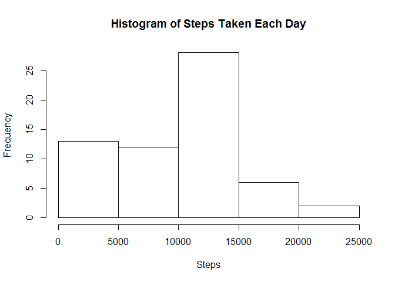
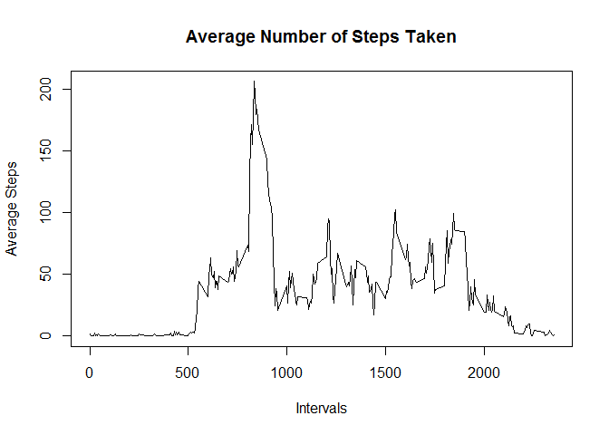
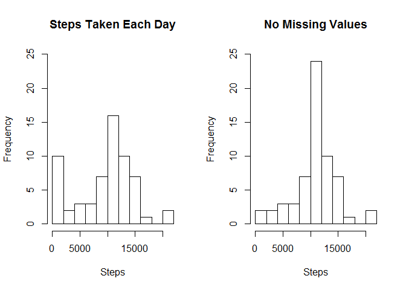

# Reproducible Research: Peer Assessment 1
Please first set your working directory to "RepData_PeerAssessment1".

## Loading and preprocessing the data


```r
ac <- read.csv(unz("activity.zip", "activity.csv"))
head(ac)
```

```
##   steps       date interval
## 1    NA 2012-10-01        0
## 2    NA 2012-10-01        5
## 3    NA 2012-10-01       10
## 4    NA 2012-10-01       15
## 5    NA 2012-10-01       20
## 6    NA 2012-10-01       25
```

***

## What is mean total number of steps taken per day?

### Histogram of the total number of steps taken each day


```r
# tsd = total steps by day
par(mfrow = c(1, 1))
tsd <- with(ac, tapply(steps, date, sum, na.rm = T))
hist(tsd, main = "Histogram of Steps Taken Each Day", xlab = "Steps")
```

<!-- -->

### Mean and median of the total number of steps taken per day


```r
meantsd <- mean(tsd)
meditsd <- median(tsd)

#Mean of the total number of steps taken each day:
meantsd
```

```
## [1] 9354.23
```

```r
#Median of total number of steps taken each day:
meditsd
```

```
## [1] 10395
```

***

## What is the average daily activity pattern?

### Time series plot of the average number of steps taken


```r
# msi = mean number of steps by interval
msi <- as.data.frame(with(ac, tapply(steps, interval, mean, na.rm = T)))
msi$interval <- rownames(msi)
names(msi) <- c("steps", "interval")
plot(msi$interval, msi$steps, type = "l", main = "Average Number of Steps Taken", xlab = "Intervals", ylab = "Average Steps")
```

<!-- -->

### The 5-minute interval that, on average, contains the maximum number of steps


```r
msi[which.max(msi$steps),]
```

```
##        steps interval
## 835 206.1698      835
```

```r
# Maximum number of steps is in interval 835, it is around 7 am.
```

***

## Imputing missing values
### Calculate and report the total number of missing values in the dataset (i.e. the total number of rows with NAs)


```r
# tmv = total number of missing values
tmv = nrow(ac) - sum(complete.cases(ac))
tmv
```

```
## [1] 2304
```

```r
# Total number of missing values in the dataset is 2304.
```

### Fill Missing Values

Replace missing values with the average steps for each interval.


```r
#fmv = fill missing values
#Merge function will change the original row order of fmv data frame, which is the order I'll use to fill the missing values in ac data frame. An extra index column could fix this problem.
fmv <- data.frame(interval = ac$interval[is.na(ac$steps)], index = c(1: 2304))
fmv <- merge(fmv, msi)
fmv <- fmv[order(fmv$index),]

ac.new <- ac
ac.new$steps[is.na(ac$steps)] <- round(fmv$steps, 0)
```

Check if missing values still exist.


```r
nrow(ac.new) - sum(complete.cases(ac.new))
```

```
## [1] 0
```

### Histogram of the total number of steps taken each day after missing values are imputed

```r
# tsd.new = total steps by day using ac.new
tsd.new <- with(ac.new, tapply(steps, date, sum, na.rm = T))

par(mfrow = c(1, 2))
hist(tsd, main = "Steps Taken Each Day", xlab = "Steps", ylim = c(0,25), breaks = 10)
hist(tsd.new, main = "No Missing Values", xlab = "Steps", ylim = c(0,25), breaks = 10)
```

<!-- -->

The new histogram looks more normally distributed than the orginal one because of the filling of the missing values using average steps of each interval. The main changes happened in lower number of steps and middle number of steps. The former one decreased and the latter one increased largely. Others remain unchanged, because there were no missing values in there.


```r
meantsd.new <- mean(tsd.new)
meditsd.new <- median(tsd.new)

#Mean of the total number of steps taken each day before and after the filling of missing values, and the percentage changes:
meantsd; meantsd.new; (meantsd.new - meantsd) / meantsd
```

```
## [1] 9354.23
```

```
## [1] 10765.64
```

```
## [1] 0.1508847
```

```r
#Median of total number of steps taken each day before and after the filling of missing values, and the percentage changes:
meditsd; meditsd.new; (meditsd.new - meditsd) / meditsd
```

```
## [1] 10395
```

```
## [1] 10762
```

```
## [1] 0.03530544
```

Both mean and median number of steps increased, but mean number of steps increased more apparently, maybe because the mean was more sensitive to extreme values.

***

## Are there differences in activity patterns between weekdays and weekends?
### Panel plot comparing the average number of steps taken per 5-minute interval across weekdays and weekends
first, create two new levels:

```r
ac.new$date <- as.Date(ac.new$date)
ac.new$type <- weekdays(ac.new$date)
weekdays <- c("Monday", "Tuesday", "Wednesday", "Thursday", "Friday")
weekends <- c("Saturday", "Sunday")
ac.new$type[ac.new$type %in% weekdays] <- "weekday"
ac.new$type[ac.new$type %in% weekends] <- "weekend"
ac.new$type <- as.factor(ac.new$type)
```


Second, calculate average number of steps taken for each interval, both on weekdays and weekends.

```r
#wd = weekdays, wk = weekends
wd <- ac.new[ac.new$type == "weekday",]
wk <- ac.new[ac.new$type == "weekend",]

#wd.msi = mean steps for each interval on weekdays, wk.msi = mean stpes for each interval on weekends.
wd.msi <- as.data.frame(with(wd, tapply(steps, interval, mean)))
wk.msi <- as.data.frame(with(wk, tapply(steps, interval, mean)))

names(wd.msi) <- "steps"
names(wk.msi) <- "steps"

wd.msi$interval <- rownames(wd.msi)
wk.msi$interval <- rownames(wk.msi)

wd.msi$type <- "weekday"
wk.msi$type <- "weekend"

msi.new <- rbind(wd.msi, wk.msi)
msi.new$interval <- as.numeric(msi.new$interval)
```

Third, make plots:

```r
library(lattice)
xyplot(steps ~ interval | type, data = msi.new, type = "l", layout = c(1, 2))
```

<!-- -->
